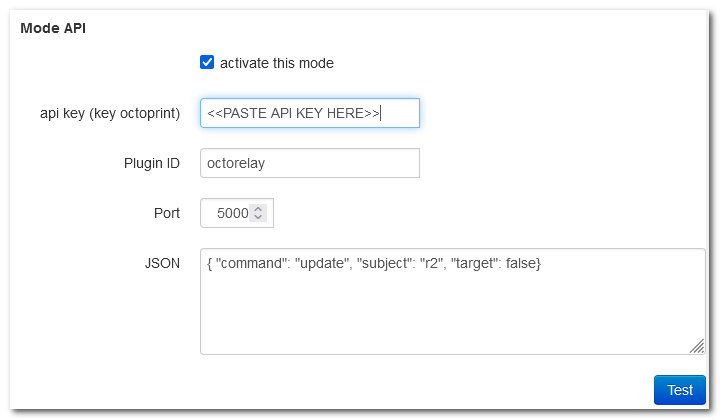

# OctoPrint Shutdown Printer

This OctoPrint plugin enables the system to take action after a print has finished. It can interact with other devices or plugins to automatically shut down printer after a print is finished.  It works with TPLink plugs, Sonoff devices flashed with Tasmota as well as generic relays via the OctoRelay Plugin.

This plugin should be able to integrate with any device(s) or web application that exposes a REST API as long as OctoPrint can communicate with it.

The user can enable shutdown print for each print by using a checkbox in the sidebar.

This plugin was inspired by the work of "Nicanor Romero Venier" on the plugin: AutomaticShutdown (https://plugins.octoprint.org/plugins/automaticshutdown/)


# Setup

Install via the bundled [Plugin Manager](https://github.com/foosel/OctoPrint/wiki/Plugin:-Plugin-Manager)
or manually using this URL:

    https://github.com/devildant/OctoPrint-ShutdownPrinter/archive/master.zip

# Plugin Configuration

For the OctoPrint-ShutdownPrinter to integrate with other OctopPrint plugins, they must be installed and configured prior to use by ShutdownPrinter
- [OctoRelay Plugin](https://plugins.octoprint.org/plugins/octorelay/) 
  - [Jump to example config](#integration-with-octorelay)
- [TP-Link Smartplug Plugin](https://plugins.octoprint.org/plugins/tplinksmartplug/)
  - [Jump to example config](#integration-with-tp-link-smartplug)
- [Tasmota Plugin](https://plugins.octoprint.org/plugins/tasmota/)
  - [Jump to example config](#integration-with-Tasmota)
- Likely anything that exposes a known REST API


# Compatibility
This plugin has a wide variety of interaction with external sources via 3 modes:
- GCODE
  - Monitoring the GCODE M81
- Octoprint API
  - Other OctoPrint other plugins via their internal API system
- Custom API 
  - Allows compatibility with most anything that has an exposed REST API OctoPrint can communicate with

## Mode GCODE
This plugin will send a GCODE after print finish with specific parameter
example : M81 192.168.1.2


## Mode API
This plugin will call specific API (OctoPrint plugin) after print finish
example for tplink : 
```api key (key octoprint) : AAAAAAAAAAAAAAAA
Plugin ID : tplinksmartplug
Port : 5000
JSON : {"command": "turnOff", "ip": "192.168.1.43" }
```
NOTE: Do not forget to put generate an Application Key (OctoPrint / Settings / Application Keys) first


## Mode API Custom 
This plugin will call specific API (external) after print finish
example for tplink : 
```
POST : enable
URL : http://127.0.0.1:5000/api/plugin/tplinksmartplug
header (json format) : {"Content-Type": "application/json", "X-Api-Key" : "AAAAAAAAAAAAAAAA"}
body : {"command": "turnOff", "ip": "192.168.1.43" }
```


## Common Settings Across All Modes


## Integration With OctoRelay
- [https://plugins.octoprint.org/plugins/octoRelay/](https://plugins.octoprint.org/plugins/octorelay/)

It is possible to use the OctoRelay plugin to turn off your printer using an existing relay configured by OctoRelay.  Here is an example configuration:


For printer shutdown control using OctoRelay, use the `Mode API` to call another internal OctoPrint plugin.
```
Plugin ID : octorelay
Port : 5000
JSON : {"command": "update", "subject": "r2", "target": false }
```
Typical values:
- `Plugin ID`
  - The specific plugin to route the API call to.
  - For controlling OctoRelay, use the value `octorelay`
- `port`
  - OctoPrint typically listens internally on port 5000 for API calls.
  - Unless you specifically changed the global API listening port, you likely want to use the value `5000` for almost all direct calls to other OctoPrint plugins when configuring `Mode API`


Update values of the following keys in the JSON payload to fit your needs:
- `subject`
  - This value is the relay to power off for system shutdown.
  - In the above example, relay #2 is mains power, so we send `"r2"`. Adjust your value to be the letter "r" concatenated with the appropriate relay number (which are indexed from 1 to 8 as configured in OctoRelay Plugin.) [`"r1"`,`"r2"`, ... `"r8"`]
- `target`
  - This value dictates the state to put the relay into to cut mains power and shut down printer.
  - As most relays are Normally-Open, you likely want to pass the value `false`.

Refer to the OctoRelay API documentation for specific information or alternative relay control calls:
- https://github.com/borisbu/OctoRelay?tab=readme-ov-file#change-the-relay-state
 
 
## Integration With TP-Link Smartplug
- [https://plugins.octoprint.org/plugins/tplinksmartplug/](https://plugins.octoprint.org/plugins/tplinksmartplug/)


```api key (key octoprint) : AAAAAAAAAAAAAAAA
Plugin ID : tplinksmartplug
Port : 5000
JSON : {"command": "turnOff", "ip": "192.168.1.43" }
```

## Integration With Tasmota
- [https://plugins.octoprint.org/plugins/tasmota/](https://plugins.octoprint.org/plugins/tasmota/)

Refer to the Tasmota plugin page for integration specifics